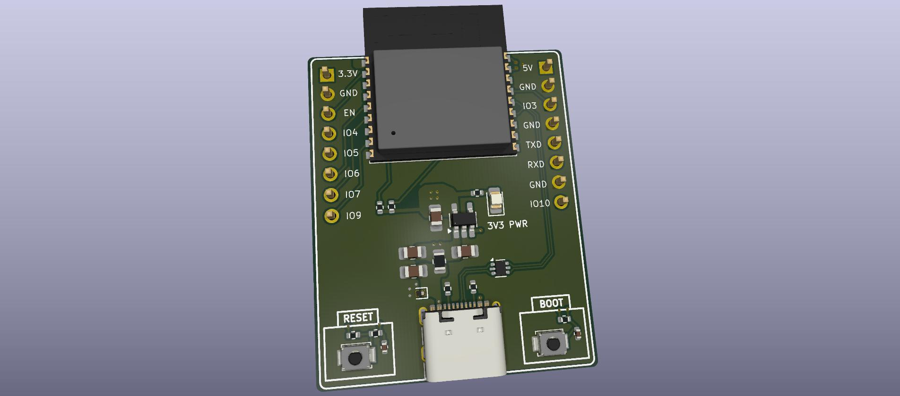
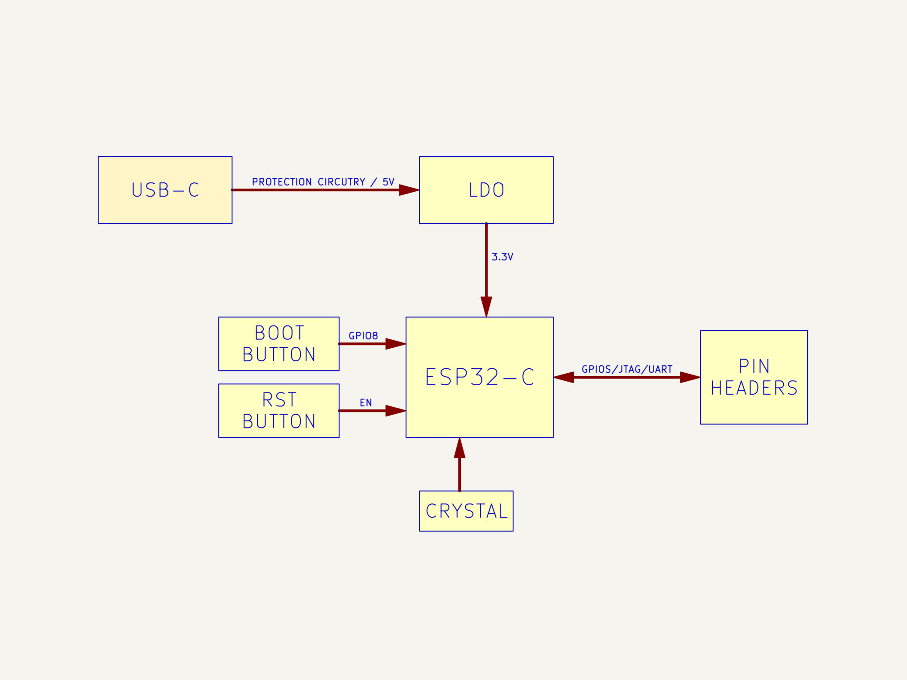
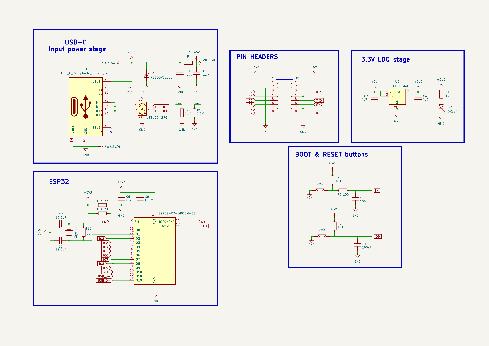
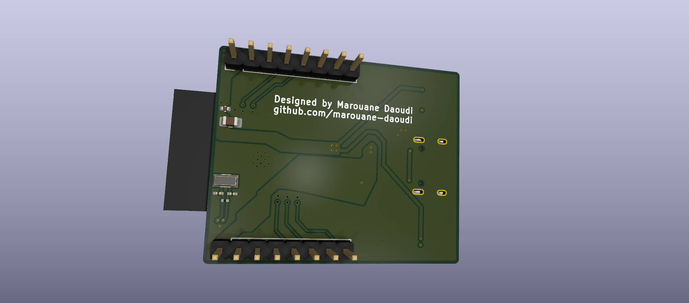
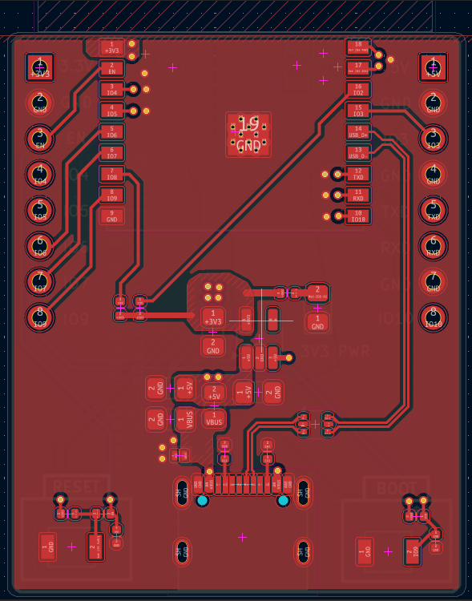
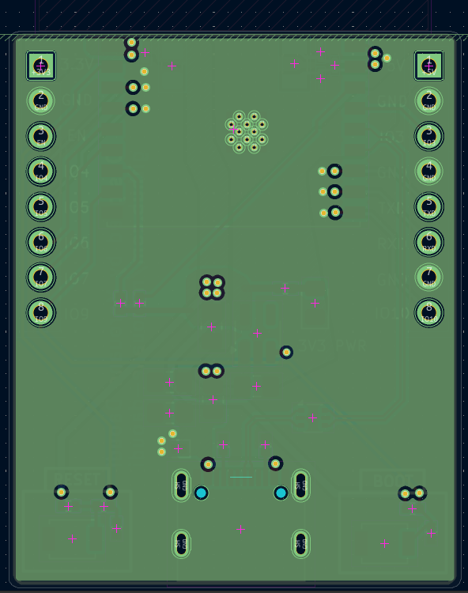
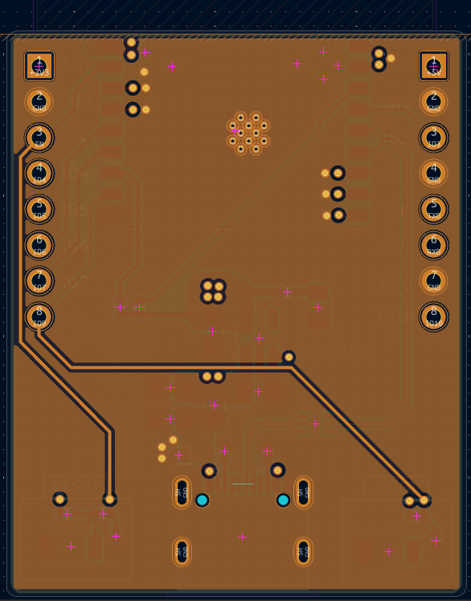
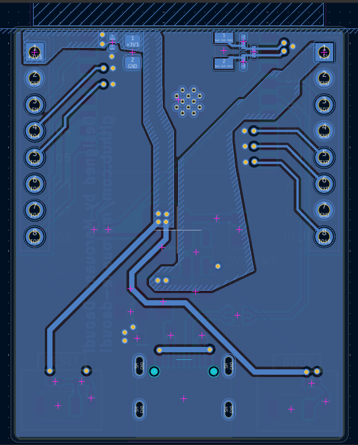
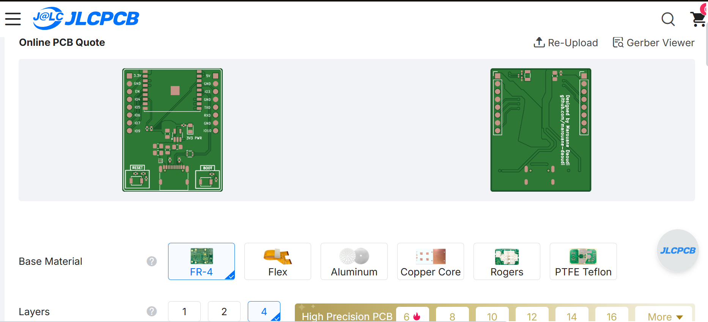

# ESP32-C3 WROOM Development Board

A 4-layer development and testing board for the ESP32-C3 WROOM 
module. USB-C powered, breadboard-compatible, with onboard LDO 
regulation, ESD protection on all external interfaces, crystal 
oscillator, reset and boot buttons, and full GPIO header access. 
Designed in KiCad with a focus on power integrity, signal 
integrity, and low-impedance current paths throughout.

---

## Specifications

| Parameter | Value |
|---|---|
| Target module | ESP32-C3 WROOM-02 |
| PCB layers | 4-layer FR4 |
| Board width | 27.94mm (breadboard compatible) |
| Pin pitch | 2.54mm |
| Input | 5V via USB-C |
| Regulated output | 3.3V — AP2112K-3.3TRG1 LDO (600mA max) |
| ESD protection (data) | USBLC6-2SC6 dual ESD diode |
| ESD protection (VBUS) | PESD5V0L1UL |
| Crystal | External oscillator for USB timing |
| Power indicator | Green LED (NATIONSTAR NCD0805G1) |
| Design tool | KiCad |

---

## Pin Header Reference

| Left Header | Right Header |
|---|---|
| 3.3V | 5V |
| GND | GND |
| EN | IO3 |
| IO4 | GND |
| IO5 | TXD |
| IO6 | RXD |
| IO7 | GND |
| IO9 | IO10 |

---

## System overview

---

## Schematic

---

## Block-by-block circuit description

### USB-C interface

A 16-pin USB-C receptacle provides 5V power delivery and USB 
2.0 data. Three groups of pins are used:

**CC1 and CC2** — each connected to GND through a 5.1kΩ 
resistor. These configuration channel pins tell the upstream 
power source that this board is a power sink requesting 5V 
at standard current. Without these resistors, modern USB-C 
chargers and laptop ports will not supply power. Both pins 
require their own resistor because the cable can be inserted 
in either orientation — only one CC pin is active per 
insertion but both must be terminated.

**D+ and D-** — USB 2.0 data lines connected to the ESP32-C3 
through the USBLC6-2SC6 dual ESD protection IC. This device 
was chosen for its low line capacitance, which is critical for 
preserving signal integrity on high-speed differential pairs — 
excessive capacitance loads the lines and degrades eye diagrams 
at USB Full Speed. A single IC protects both lines 
simultaneously.

**VBUS** — the 5V supply rail, protected and filtered before 
entering the rest of the circuit through two stages: a 
PESD5V0L1UL ESD diode clamping surge voltages, followed by a 
pi filter (capacitor — 0Ω resistor — capacitor) for additional 
conducted noise filtering. The 0Ω resistor is a deliberate 
design choice — it can be replaced with a polyfuse for 
overcurrent protection on future revisions without redesigning 
the PCB.

### LDO voltage regulation

The AP2112K-3.3TRG1 LDO regulates 5V from VBUS down to the 
3.3V required by the ESP32-C3. It was chosen over a switching 
regulator for two reasons: it keeps the design compact, and it 
produces no switching noise — important for a board with RF and 
ADC functionality where a switching regulator's ripple could 
degrade performance.

The AP2112K is rated for 600mA output current, covering the 
ESP32-C3's typical current demand with sufficient margin. The 
datasheet recommends 1µF input and output decoupling capacitors. 
4.7µF was used instead for two reasons: the same value was 
already introduced in the pi filter stage (simplifying the BOM), 
and slightly larger decoupling capacitance improves transient 
response under sudden load steps.

### Crystal oscillator

An external crystal oscillator provides the precise clock 
reference required for USB Full Speed timing. The ESP32-C3 
WROOM module includes an internal RC oscillator but it is 
insufficiently accurate for USB — USB 2.0 Full Speed requires 
clock accuracy within ±2500ppm, which only an external crystal 
can reliably provide. Load capacitors are placed symmetrically 
on both crystal pins per the datasheet recommendations.

### Reset circuitry (EN pin)

A push button pulls the EN pin to GND when pressed, triggering 
a hard reset of the ESP32-C3. EN is normally held HIGH through 
a pull-up resistor to VCC. An RC filter is added per the 
ESP32-C3 datasheet recommendation — the resistor and capacitor 
form a low-pass filter that prevents mechanical switch bounce 
from generating spurious reset pulses. Without this filter, 
a single physical button press can produce multiple rapid 
transitions on EN, causing repeated resets instead of a clean 
single reset event.

### Boot button (IO9)

The ESP32-C3 determines boot mode by reading IO2, IO8, and IO9 
at startup. For normal operation all three must be HIGH. For 
USB download mode (firmware flashing), IO9 must be LOW while 
the others remain HIGH. IO2 and IO8 are permanently pulled HIGH 
through resistors. A dedicated BOOT button pulls IO9 LOW only 
when pressed — releasing it returns IO9 HIGH through its pull-up 
resistor, allowing normal operation. The button is only 
effective when pressed simultaneously with RESET, which forces 
the chip to sample the boot pins at startup.

### Power indicator LED

A green LED (NATIONSTAR NCD0805G1, 0805 package) with a 1kΩ 
current-limiting resistor indicates active 3.3V power on the 
board. It was added after the rest of the design was complete 
as a simple functional indicator.

---

## PCB layout and routing

### 3D render

### Front layer (signal + components)

### Layer 2 — continuous ground plane

### Layer 3 — Long switch connections

### Back layer (Power distribution planes (VBUS, 3.3V), crystal, additional signals)

### 4-layer stackup

| Layer | Function |
|---|---|
| Layer 1 (top) | Signal routing, components, ESD, LDO, USB-C |
| Layer 2 | Continuous solid ground plane |
| Layer 3 | Long switch connections (EN and IO9 routing only) |
| Layer 4 (bottom) | Power distribution planes (VBUS, 3.3V), crystal, additional signals |

Layer 2 is kept as an uninterrupted solid ground plane 
throughout the entire board. Every high-speed signal on the top 
layer is referenced to this plane, ensuring a controlled return 
path directly beneath each trace. This is the single most 
important layout decision on the board — a broken ground plane 
forces return currents to take longer paths, increasing loop 
inductance and radiating EMI.

### Placement strategy

Components were placed by following the power flow of the 
circuit from input to output, grouping by functional block 
before routing began:

USB-C connector at the bottom edge → ESD protection immediately 
adjacent → pi filter following → LDO stage → decoupling 
capacitors → ESP32-C3 module at the top. This left-to-right, 
input-to-output placement minimizes trace length on the power 
path and keeps high-current paths short and direct.

### Power distribution — local copper planes

All power connections use custom-shaped local copper planes 
rather than routed traces. Three separate planes were defined: 
one for VBUS (5V from USB), one for the LDO input (5V filtered), 
and one for the 3.3V output. Copper planes provide 
significantly lower resistance and inductance than traces of 
equivalent length — critical during transient load events when 
the ESP32-C3 core suddenly demands current during Wi-Fi 
transmission bursts.

The 3.3V plane runs from the LDO output capacitor directly to 
the ESP32-C3 decoupling capacitors, ordered deliberately: the 
4.7µF bulk capacitor sees the current first, followed by the 
100nF high-frequency decoupling capacitor, then vias transfer 
the 3.3V to the ESP32-C3 power pin on the front layer. THT 
pin headers connect directly to the back copper plane, 
providing clean 3.3V and 5V access at the headers without 
additional routing.

### ESD protection placement

The USBLC6-2SC6 (data line ESD) and PESD5V0L1UL (VBUS ESD) 
are placed immediately at the USB-C connector pads — the first 
components the external signals reach after entering the board. 
Three ground vias are placed directly adjacent to the ESD diode 
ground pads, providing the shortest possible low-impedance 
discharge path to the ground plane during an ESD event. 
Inductance in the discharge path reduces clamping effectiveness 
— minimizing this path length is as important as the protection 
device selection itself.

### USB differential pair routing

D+ and D- are routed as a tightly coupled differential pair on 
the top layer, referenced to the continuous ground plane on 
layer 2. The route is kept as short as possible from the USB-C 
connector through the ESD protection device to the ESP32-C3 
module. Trace lengths are matched and spacing is kept constant 
throughout to maintain the 90Ω differential impedance required 
by USB 2.0. Routing on the surface layer directly above the 
ground plane ensures a well-defined return path with minimal 
loop area.

### Crystal routing

The crystal and its load capacitors are placed on the back 
layer to conserve space on the front. Traces are kept short 
and routed symmetrically on both oscillator pins — asymmetry 
in crystal routing introduces parasitic differences between 
the two pins that can prevent oscillation startup or cause 
frequency instability. Vias transfer the crystal signals 
between back and front layers at the ESP32-C3 pins.

### General signal routing

GPIO and power pins for the headers were routed straightforwardly. 
Where traces would have conflicted with high-speed signal areas 
on the front layer, the THT nature of the pin headers was 
exploited — signals were dropped to the back layer via vias 
and routed there, keeping the top layer clean for the 
differential pair and crystal signals. The EN and IO9 
connections to the RESET and BOOT buttons required a long 
connection routed on layer 3 to avoid interference with other 
routing layers.

### Ground fill

Ground copper fills were applied to all four layers after 
routing was complete, filling all unused copper areas. 
This reduces EMI by eliminating antenna-like copper islands, 
lowers ground impedance across the board, and provides 
additional shielding between signal layers. Layer 2 was 
maintained as a completely uninterrupted solid ground plane 
with no signal routing passing through it at any point.

### Antenna keep-out zone

A 5mm keep-out zone is enforced beneath the ESP32-C3 WROOM 
module's PCB antenna on all four layers. Copper beneath the 
antenna detunes it by altering the antenna's electromagnetic 
environment, reducing Wi-Fi range and reliability. No traces, 
planes, or fills enter this zone.

---

## What I learned building this

This was the most technically demanding board in this portfolio 
and introduced concepts not present in simpler 2-layer designs:

- 4-layer stackup design and strategic layer assignment
- Power planes vs traces — impedance and inductance tradeoffs
- Local copper planes for low-impedance power distribution
- Decoupling capacitor ordering and placement as a 
  layout-critical decision, not just a schematic one
- ESD protection placement rules and discharge path inductance
- Ground via stitching adjacent to ESD devices for 
  low-inductance discharge paths
- USB differential pair routing with length matching and 
  controlled impedance
- Crystal oscillator routing — symmetry and trace length 
  constraints
- Antenna keep-out zone enforcement across all layers
- Ground fill strategy and copper island elimination
- Using THT via penetration to simplify back-layer routing

---

## Manufacturing

Gerber files in `/gerbers` verified with JLCPCB's online 
Gerber viewer.

To order, zip the contents of the gerbers folder and upload 
to JLCPCB or PCBWay. Select:

- Layers: 4
- Material: FR4
- Thickness: 1.6mm
- Stackup: JLC04161H-7628 (standard JLCPCB 4-layer)

---

## Repository contents

| Folder | Contents |
|---|---|
| `/kicad` | Schematic, PCB, and project files |
| `/gerbers` | Fabrication-ready Gerber and drill files |
| `/images` | 3D renders and PCB layer screenshots |

---

## Author

**Marouane Daoudi**  
Electrical Engineering student   
Designed in KiCad
